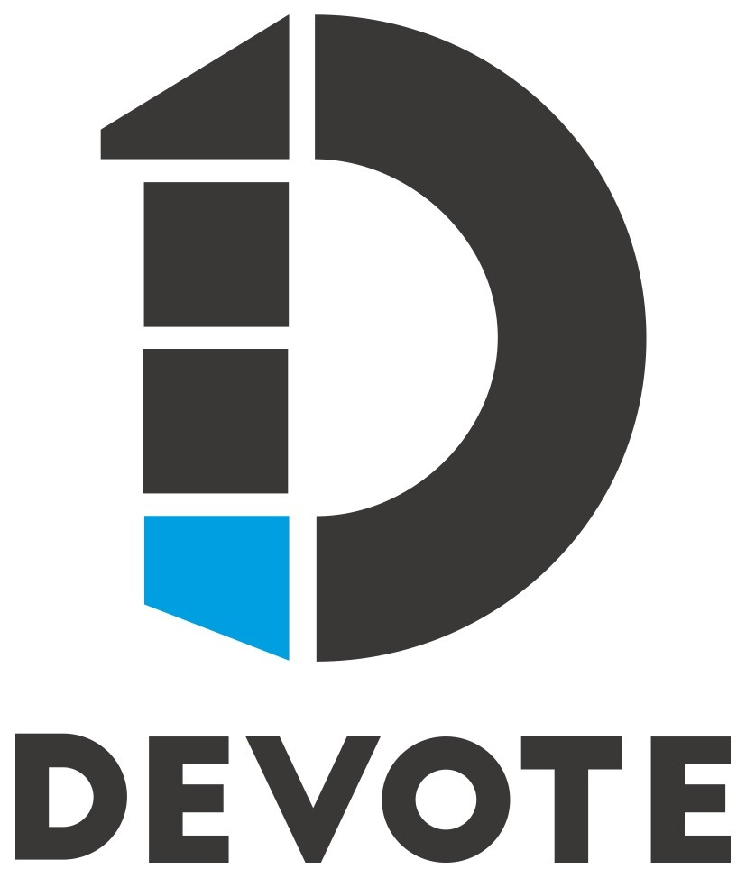

# Welcome to IntuneMacAdmins

A community hub for sharing and learning from real-world macOS experiences — guides, scripts, tools, and best practices, all in one place. Continuously improved and updated by experts.


New here? Start with the [Getting Started guide](home/getting-started.md), or jump straight to the [Baseline Settings](baselinesettings/import.md) to configure your tenant fast.


## Our Sponsors ❤️

A big thank you to our sponsor for supporting the community and helping keep these resources free.

[Visit Devote →](https://www.devote.com)

## Get started

### Chat with the Copilot

Ask the Copilot anything related to macOS management in Intune. [Start chatting →](https://copilot.intunemacadmins.com)

### Jumpstart with our Baseline Settings

Quickly manage your macOS devices with curated settings from the Open Intune Baseline (OIB) project. [Import the Baseline Settings →](baselinesettings/import.md)

## Core Contributors 🏆

| Contributor | Role | Links |
| --- | --- | --- |
| **Ugur Koc** | Microsoft MVP & Cloud Engineer @ glueckkanja | [X](https://x.com/UgurKocDe) · [LinkedIn](https://www.linkedin.com/in/ugurkocde/) · [Blog](https://ugurkoc.de) |
| **Somesh Pathak** | Microsoft MVP & Infrastructure Engineer @ NN Group | [X](https://x.com/pathak_somesh) · [LinkedIn](https://www.linkedin.com/in/someshpathak/) · [Blog](https://www.intuneirl.com/) |
| **Steffen Schwerdtfeger** | Cloud Architect @ glueckkanja | [X](https://x.com/SteffenAtCloud) · [LinkedIn](https://www.linkedin.com/in/steffen-schwerdtfeger/) · [Blog](https://www.manage-everything.cloud/) |
| **Niklas Tinner** | Microsoft MVP & Founder @ Oceanleaf | [X](https://x.com/NiklasTinner) · [LinkedIn](https://www.linkedin.com/in/niklas-tinner/) · [Blog](https://www.oceanleaf.ch/) |
| **Joery Van den Bosch** | Microsoft MVP & Modern Work Architect @ Arxus | [X](https://x.com/joerieke) · [LinkedIn](https://www.linkedin.com/in/joery/) · [Blog](https://intunestuff.com/) |
| **James Robinson** | Microsoft MVP & EUC Workstream Lead @ PowerON | [X](https://x.com/SkipToEndpoint) · [LinkedIn](https://www.linkedin.com/in/skiptotheendpoint/) · [Blog](https://skiptotheendpoint.co.uk/) |

## Other resources

- [Official Microsoft Docs for macOS Management](https://learn.microsoft.com/en-us/mem/intune/fundamentals/deployment-guide-enrollment-macos)
- [Microsoft Mac Admins Group on LinkedIn](https://www.linkedin.com/groups/13007354/)
- [Mac Admins Slack](https://join.slack.com/t/macadmins/shared_invite/zt-2li6s6akl-ZaR7ZVwg6Tj~8XPSUgFQ~Q)
- [Mac Admins Software](https://macadmins.software/)

---

- [**Community Contributors ❤️**](home/contributors.md) — thank you to everyone helping improve IntuneMacAdmins.
- [**Contribute on GitHub**](https://github.com/ugurkocde/IntuneMacAdmins) — add your name to the list of contributors.
