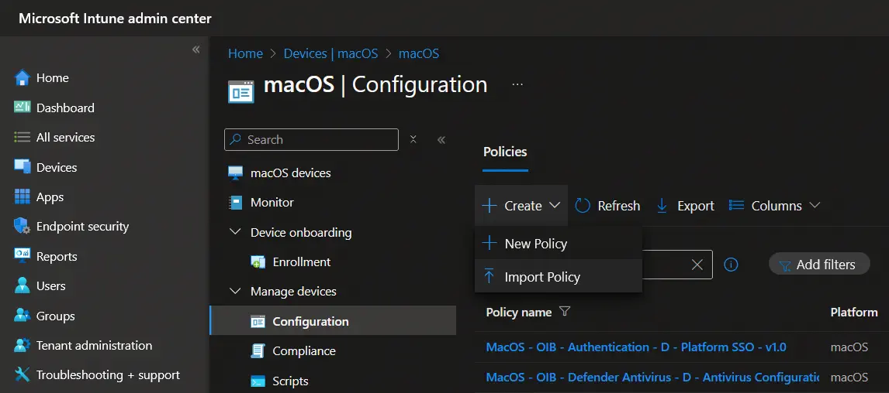
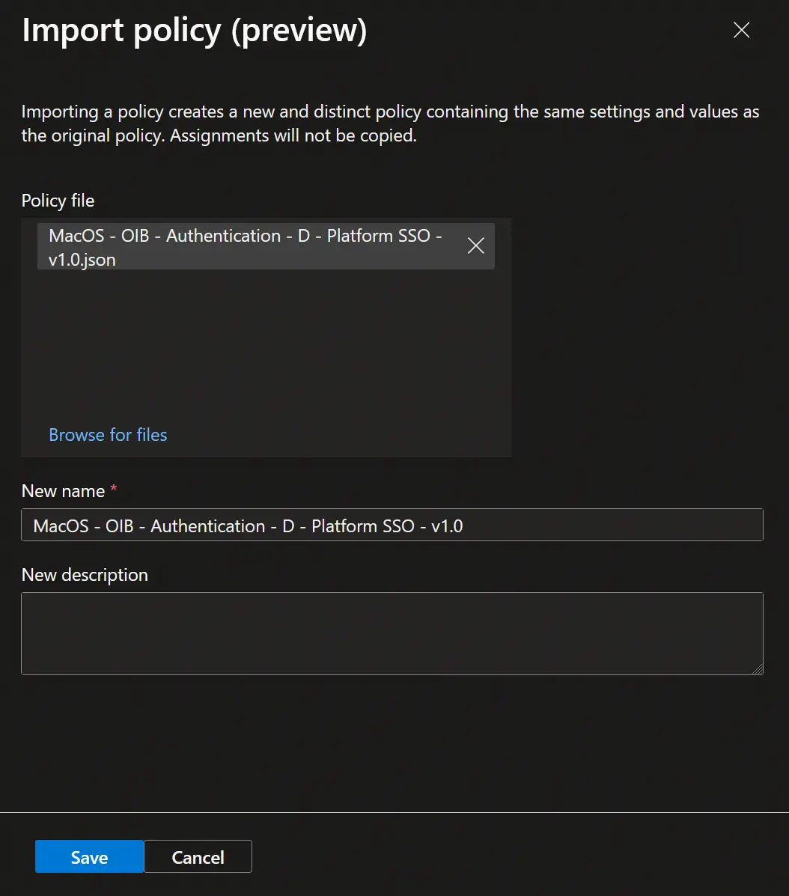

# Importing Baseline Settings into Intune

Following these steps, you will be able to import the baseline settings into your Intune tenant.

1. Download the JSON files from the <a href="https://github.com/SkipToTheEndpoint/OpenIntuneBaseline/tree/main/MACOS/NativeImport" target="_blank">OpenIntuneBaseline</a> repository.
2. Go to the <a href="https://intune.microsoft.com/#home" target="_blank">Intune Portal</a> and select **Devices**.
3. Select **macOS** then **Configuration profiles** and click on **Import profile**.

4. Drag and drop the **JSON file** into the window and choose a **name** for the profile.
   
5. Click on **Save** and wait for the profile to be created.
6. Repeat steps 3-5 for each JSON file.


**Tips**

- Ensure you have the necessary permissions to import profiles in Intune.
- Double-check the JSON files for any errors before importing.
- Consider creating a test profile first to ensure the settings are applied correctly.




**Troubleshooting**

- If you encounter an error during import, verify the JSON file format.
- Check your network connection and try again.
- Ensure that the JSON file is not corrupted or incomplete.
- Consult the <a href="https://docs.microsoft.com/en-us/mem/intune/configuration/device-profile-troubleshoot" target="_blank">Intune troubleshooting guide</a> for more help.


