# User Experience on a MacOS Device

## User Experience on a MacOS Device

Remember that we left our Mac device after we enrolled it in Apple Business Manager, reboot it. Now just follow the setup assistant to continue onboarding you Mac into Intune With Platform SSO. These are the screenshots during enrollment. Apparently there is a limit on the screenshots you can make during the setup assistant so i missed some. But i think you will get the  complete overview of what is going on. My apologies for this.

Select Country or region

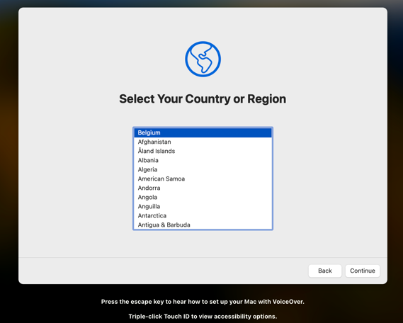

Click Continue

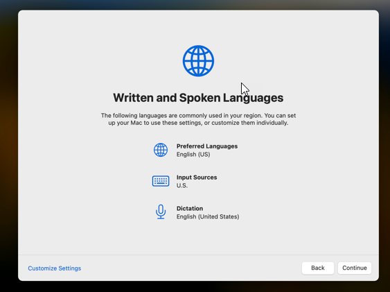

Click not now

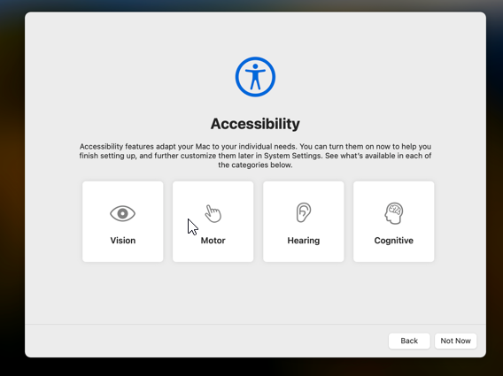

Connect to Wifi

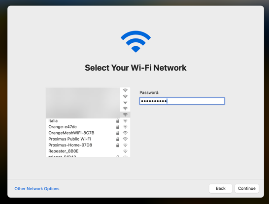

Click Continue

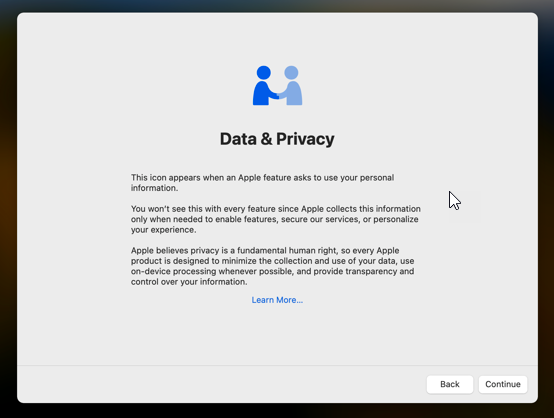

Now you can see that your device has got the Company enrollment profile, click enroll

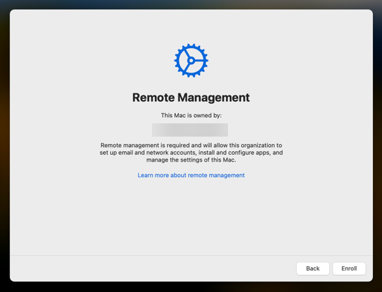

Sign in with your Entra ID credentials and accept the MFA request if needed

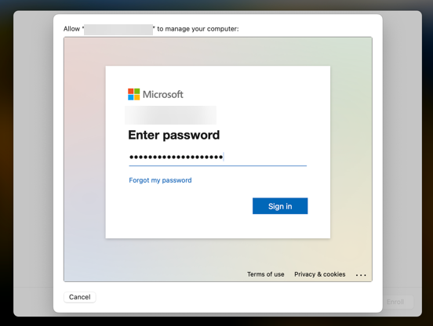

Now all Intune profiles are being installed, just watch the progress

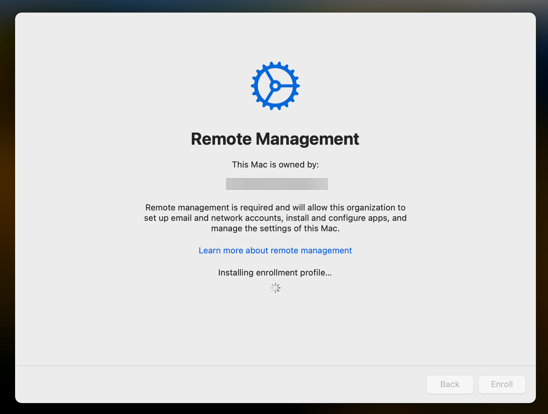

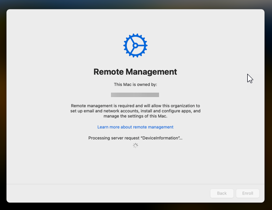

Now i had to take a picture with my phone, pretty amateuristic i know…. 🙂

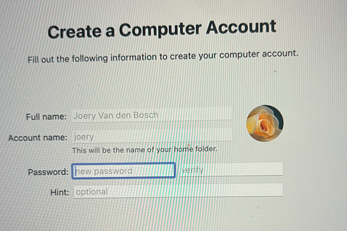

From now on you will go to the desktop of the Mac, check the message in the top right corner, click it

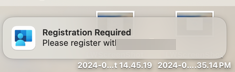

Now enter your local user password or use touch id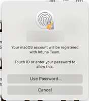

Enter your Entra ID credentials and approve MFA if needed

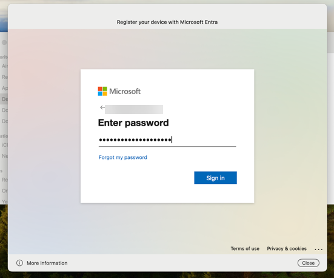

Preparing your device

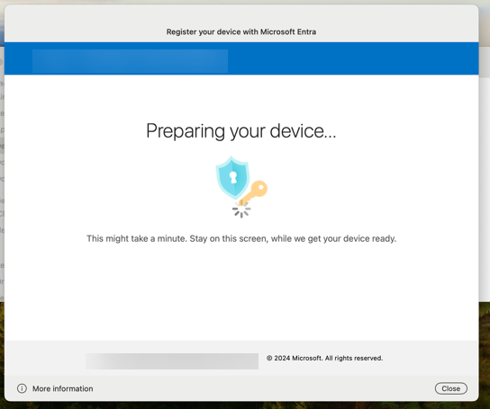

Toggle on Company Portal and click open System Settings

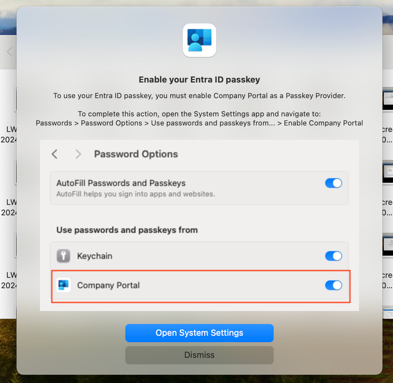

Toggle on Company Portal and click close

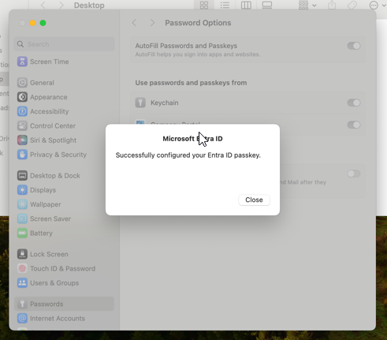

Go to Finder – Applications – Company Portal – Click sign in

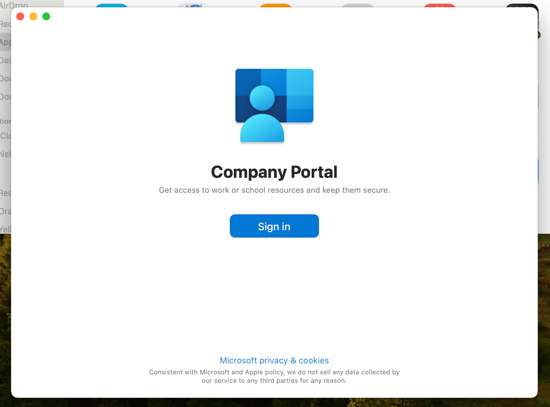

Check the SSO page, this is what we want to see, click continue

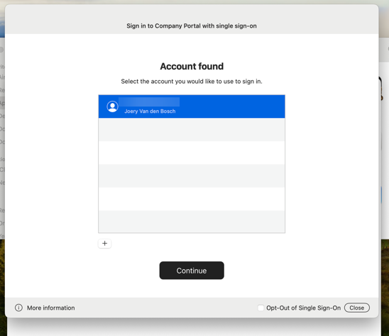

Now all is configured

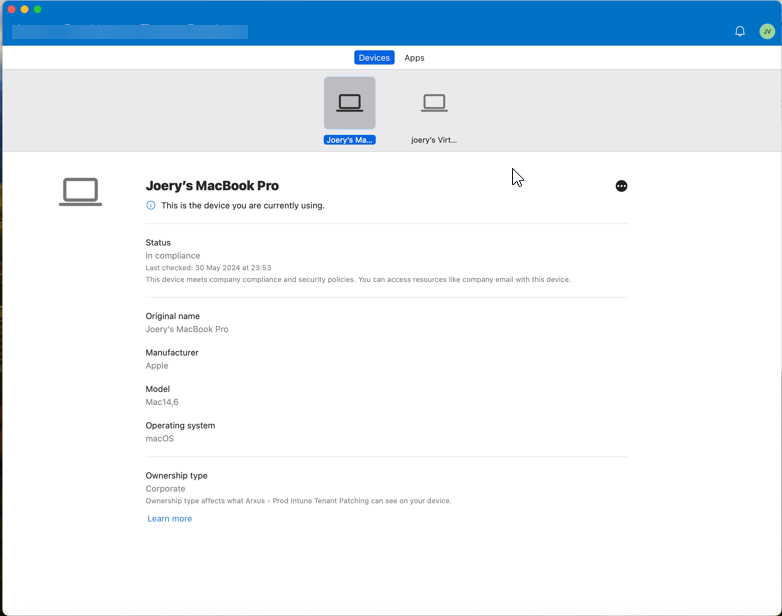

You can check if all is OK by going to settings – users & groups and clicking on the Entra ID user

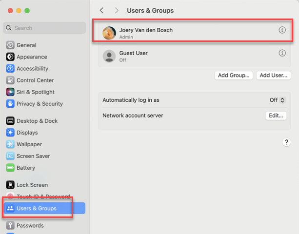

In the next window you can see that everything is ok

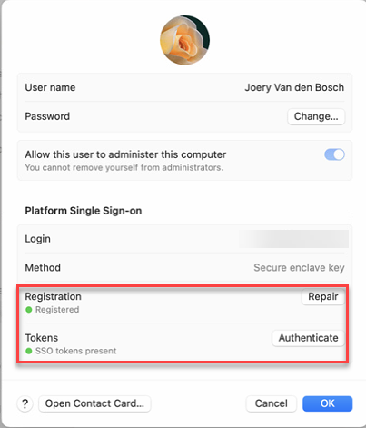
