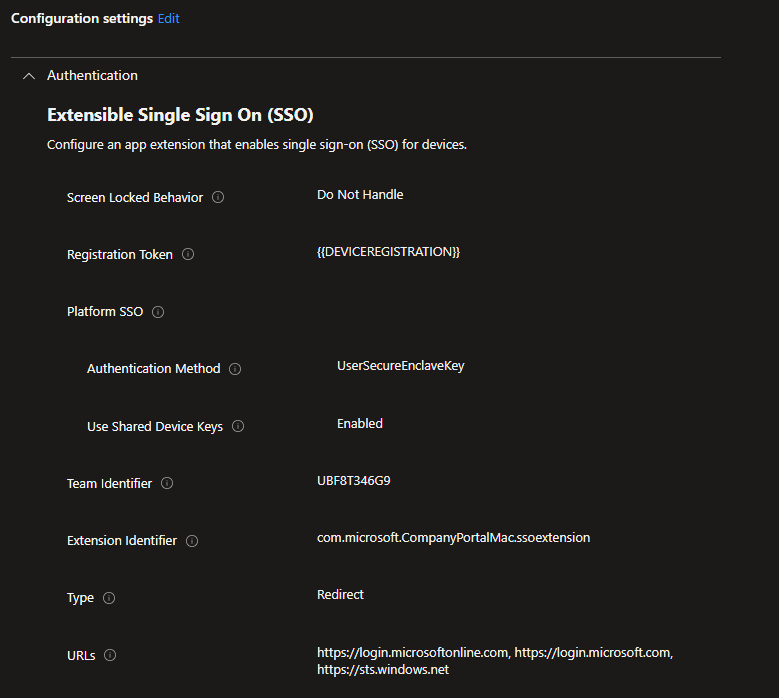
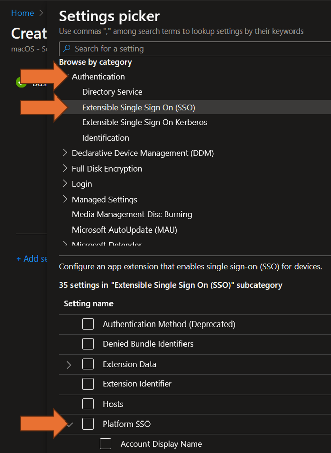
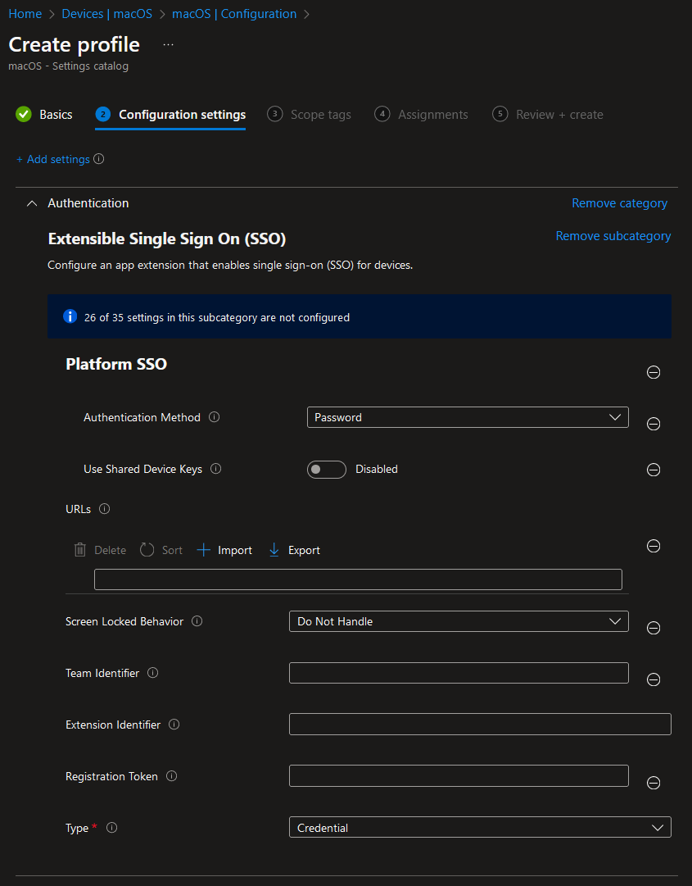

# Configure PSSO


Due to being phishing resistant and generally more secure we will show how to setup PSSO with Secure Enclave in Intune. Alternatively you can follow this guide and select one of the other authentication methods.


Before we begin, just a heads up that you can find the official guide by Microsoft here: https://learn.microsoft.com/en-us/mem/intune/configuration/platform-sso-macos#step-1---decide-the-authentication-method

While the article by Microsoft goes in detail about the differences of each method and what to choose when, we will focus on the configuration policy.

Here is the final configuration profile:

### Import the policy

1. You can [download a ready to use PSSO policy from here](../.gitbook/assets/PSSO/PSSO_Configuration_Policy.json). Right click and select "Save as ..." to save it locally on your device.
2. Go to the [Intune Portal](https://intune.microsoft.com/#view/Microsoft_Intune_DeviceSettings/DevicesMacOsMenu/~/configuration) and sign in.
3. Select Create -> Import Policy and Upload the .json file that you have downloaded earlier.

### Create the policy manually

1. Go to the [Intune Portal](https://intune.microsoft.com) and sign in.
2. Go to Devices -> macOS -> Configuration or use this Link: [macOS | Configuration](https://intune.microsoft.com/#view/Microsoft_Intune_DeviceSettings/DevicesMacOsMenu/~/configuration)
3. Select Create -> New Policy -> Profile Type is Settings Catalog
4. Give the policy a name and click on next
5. You can find the Platform SSO Settings in the Settings picker at Authentication -> Extensible Single Sign On (SSO) -> Platform SSO

1. For our configuration policy please select the following settings from the list:
   1. Platform SSO:
      1. Authentication Method
      2. Use Shared Device Keys
   2. Registration Token
   3. Screen Locked Behavior
   4. Team Identifier
   5. URLs
2. After selecting the above settings your profile should look like the following screenshot:

1. We can now configure the settings. Here is a working example:

1. After that, you can add scope tags and assign the policy.
2.  Done :)

This video shows the user experience:


